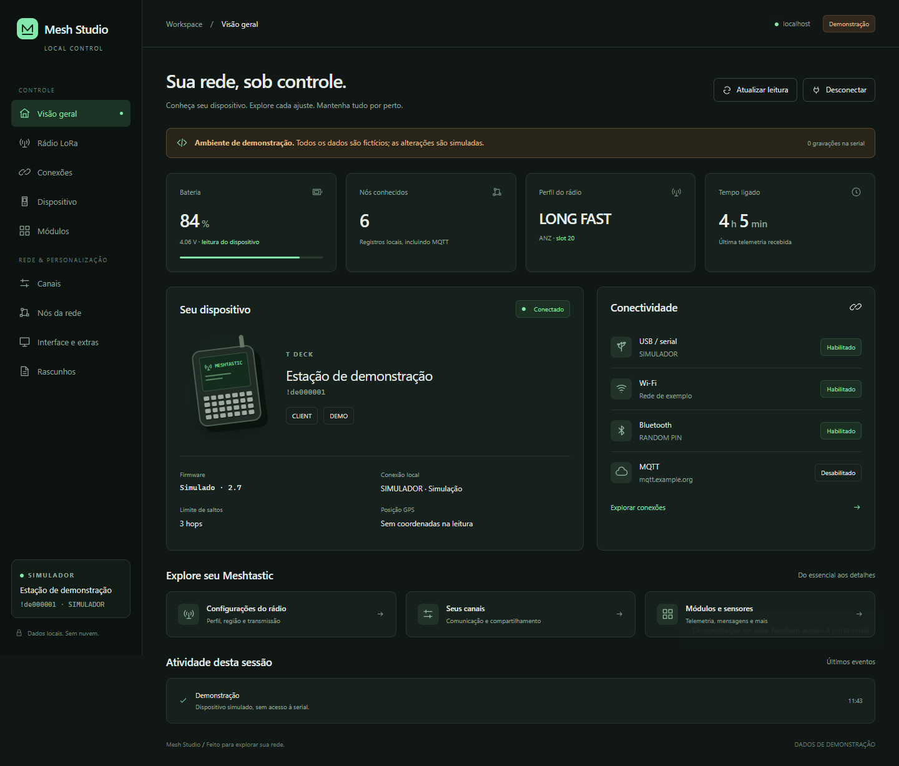

# Mesh Studio

Web app local, em português, para consultar e editar configurações de um Meshtastic conectado por USB/serial ou pela rede local via TCP. A interface tem painel do dispositivo, nós conhecidos, formulários gerados pelo protocolo, editor JSON, revisão de rascunhos e mensagens de canais e diretas.

**A inicialização padrão bloqueia gravações de configuração e envio de mensagens reais no servidor e na camada de comunicação.** É possível editar e revisar rascunhos sem enviá-los ao rádio. O simulador permite testar uma aplicação completa sem conectar hardware.



## Instalação passo a passo no Windows

O app roda em um computador conectado ao rádio por USB ou com acesso ao IP do rádio pela rede. Não é necessário instalar Node.js, compilar o frontend ou baixar outro repositório.

### 1. Instale os pré-requisitos

- **Python 3.11 a 3.14**. Python 3.12 é uma opção compatível. No instalador do Python para Windows, habilite **Add python.exe to PATH**.
- **Git**, para baixar e atualizar o projeto.
- Um navegador atualizado. O dispositivo físico é opcional para explorar o simulador.

Depois da instalação, abra uma nova janela do **PowerShell** e confira:

```powershell
python --version
git --version
```

Se um comando não for encontrado, confira a instalação e o PATH antes de continuar. A primeira instalação precisa de internet para baixar as dependências Python.

### 2. Baixe o projeto

No PowerShell, entre na pasta em que deseja guardar o projeto e execute:

```powershell
git clone https://github.com/jvxis/meshtastic-studio.git
cd meshtastic-studio
```

### 3. Instale e inicie

```powershell
.\start.ps1
```

Na primeira execução, o script cria o ambiente isolado `.venv` e instala `requirements.txt`, incluindo a biblioteca Meshtastic do PyPI. Aguarde a mensagem do servidor com o endereço local e **deixe essa janela aberta**.

O modo padrão é somente leitura. Se o Windows bloquear a execução de scripts PowerShell, use a [instalação manual](#instalação-manual-no-windows) abaixo; ela não exige mudar a política de execução.

### 4. Abra o app

Acesse **http://127.0.0.1:8765** no navegador da mesma máquina.

Clique em **Explorar demonstração** para testar a interface com dados fictícios. No simulador, até as aplicações de configurações são fictícias.

### 5. Conecte seu rádio

#### USB / Serial

1. Conecte o Meshtastic por USB usando um cabo com transmissão de dados.
2. Feche outros programas que estejam usando a porta serial, inclusive clientes web conectados por USB.
3. Se estiver no simulador, clique primeiro em **Desconectar**.
4. Na visão geral, clique em **Buscar portas**, selecione **USB / Serial**, escolha a porta COM correspondente ao seu equipamento e clique em **Conectar dispositivo**.
5. Aguarde a leitura. A conexão inicial pode levar cerca de 40 segundos, dependendo do dispositivo e do número de nós armazenados.

**Conectar dispositivo** lê o rádio e mantém essa mesma conexão aberta, já recebendo mensagens. Não há escolha adicional de modo nem uma segunda etapa de escuta. Mensagens e configurações usam a conexão existente. Para liberar o rádio, use **Desconectar** na página Mensagens.

#### Rede / TCP

1. Configure previamente o Wi-Fi ou Ethernet do rádio e descubra seu IP pela tela do aparelho ou pela lista DHCP do roteador. O app não precisa do cabo USB para operar por TCP.
2. Mantenha o computador com acesso à rede do rádio. Uma reserva DHCP no roteador ajuda a conservar o mesmo IP.
3. Encerre a sessão atual, se houver. Na visão geral, selecione **Rede / TCP** em **Tipo de conexão**.
4. Preencha a caixa **IP ou nome do rádio**, por exemplo `192.168.1.50` ou `radio.local`. Informe somente o endereço, sem `http://`, caminho ou porta. Nomes dependem da resolução disponível no computador; IPv6 também é aceito, sem colchetes.
5. Mantenha **Porta TCP** em **4403**, salvo se o firmware utilizar outra porta, e clique em **Conectar dispositivo**.
6. A primeira conexão TCP permanece aberta para mensagens e configurações. A identidade do rádio é conferida em cada nova conexão, inclusive se o IP passar a apontar para outro aparelho.

O TCP conecta diretamente à Client API do rádio; não depende de MQTT. A interface web continua em **http://127.0.0.1:8765**, no computador que executa o servidor. A escolha TCP não publica o app na rede. A API TCP do rádio deve ser utilizada em rede confiável, sem encaminhar sua porta para a internet.

**T-Deck com MUI:** na versão de firmware `2.7.26.54e0d8d` examinada, o servidor TCP não é iniciado quando `displaymode=COLOR` (MUI), mesmo com Wi-Fi e MQTT funcionando. Veja a [condição no código do firmware](https://github.com/meshtastic/firmware/blob/54e0d8d0ab2ff56b3a9ce967e53f79e49af560fb/src/mesh/wifi/WiFiAPClient.cpp#L208). Nessa condição, use USB no app ou escolha manualmente um modo/firmware compatível com TCP, como BaseUI quando suportado. O app não muda o modo de tela nem reinicia o rádio automaticamente. Trocar o transporte não sincroniza os históricos do app e da MUI nem garante uso simultâneo da Client API.

Alterar o próprio Wi-Fi, IP ou Ethernet pelo TCP pode derrubar a conexão. Se a verificação ficar pendente, confira o novo endereço ou use USB para reler antes de tentar novamente. O app não reconecta nem repete gravações ou mensagens automaticamente após uma queda TCP.

Explore as configurações pelo menu lateral. Se uma seção não veio na conexão inicial, use **Consultar seção**. O firmware pode não implementar todas as seções descritas pelo protocolo.

### 6. Encerrar e usar novamente

Use **Desconectar** na página Mensagens para liberar o rádio e preservar o histórico na sessão. **Conectar ao rádio** retoma a recepção. Use **Encerrar sessão** para remover a leitura da memória do servidor e os rascunhos da página atual; no simulador, use **Desconectar**. No terminal do servidor, pressione **Ctrl+C** para encerrar o app.

Nas próximas utilizações, abra o PowerShell na pasta `meshtastic-studio` e execute novamente:

```powershell
.\start.ps1
```

## Atalho no desktop e encerramento pelo app

Depois de instalar, execute na pasta do projeto para criar o atalho **Mesh Studio**:

```powershell
.\create-shortcut.ps1 -AllowWrites
```

Se o Windows bloquear o script, este comando usa `RemoteSigned` somente no processo que cria o atalho, sem mudar a política persistente do sistema:

```powershell
powershell.exe -NoProfile -ExecutionPolicy RemoteSigned -File .\create-shortcut.ps1 -AllowWrites
```

O atalho abre a página no navegador. Se o servidor não estiver rodando, inicia em segundo plano na porta **8765**, sem janela de terminal. Se já estiver rodando, apenas abre a página, sem iniciar outro processo. Dois cliques simultâneos também compartilham o mesmo servidor. O atalho não conecta o rádio automaticamente.

`-AllowWrites` autoriza mensagens e configurações quando o atalho inicia um novo servidor. Omita essa opção para criar um atalho de somente leitura. Abrir um servidor já iniciado preserva sua permissão atual. Se outra aplicação ocupar a porta, o atalho informa o problema e não encerra processos. Para mudar de porta, use `-Port` ao criar o atalho. Se mover a pasta do projeto, crie o atalho novamente.

No menu lateral, clique em **Encerrar app** para liberar USB/TCP e parar o servidor. O app espera uma comunicação em andamento terminar antes de fechar a conexão. A página informa quando você pode fechar a aba; o navegador pode impedir que uma página feche sua própria aba automaticamente. **Fechar apenas a aba não para o servidor nem libera a COM.**

Encerrar apaga o histórico da sessão e os rascunhos em memória. Se houver rascunhos ou envio em andamento, a interface pede confirmação antes de encerrar. As configurações já salvas no rádio permanecem. Para apenas liberar o rádio e manter o servidor/histórico, use **Desconectar** em Mensagens.

O encerramento pelo app funciona com o atalho, `start.ps1` e `python -m server.run`. Instâncias antigas iniciadas diretamente com `uvicorn` precisam ser encerradas pelo terminal e iniciadas pelo novo comando. A inicialização pelo atalho registra diagnósticos locais em `artifacts/launcher-server-8765.log`, pasta ignorada pelo Git.

## Instalação manual no Windows

Após baixar o projeto e entrar em sua pasta, execute estes comandos no PowerShell:

```powershell
python -m venv .venv
.\.venv\Scripts\python.exe -m pip install -r requirements.txt
$env:MESH_ALLOW_WRITES = "0"
.\.venv\Scripts\python.exe -m server.run --port 8765
```

Não é necessário ativar o ambiente virtual. Abra **http://127.0.0.1:8765**, mantenha o terminal aberto e siga os passos de conexão descritos acima.

## Linux e macOS

A validação com rádio físico desta versão foi feita no Windows. Para executar o app em Linux ou macOS com Python 3.11 a 3.14:

```bash
git clone https://github.com/jvxis/meshtastic-studio.git
cd meshtastic-studio
python3 -m venv .venv
.venv/bin/python -m pip install -r requirements.txt
MESH_ALLOW_WRITES=0 .venv/bin/python -m server.run --port 8765
```

Abra **http://127.0.0.1:8765**. Os nomes das portas e suas permissões dependem do sistema operacional. No Linux, o suporte a `venv` pode precisar ser instalado pelo gerenciador de pacotes da distribuição. Não é necessário executar o app como administrador/root.

## Atualizar a instalação

Encerre o servidor e execute na pasta do projeto:

```powershell
git pull --ff-only
.\start.ps1 -Install
```

O parâmetro `-Install` reinstala/verifica as dependências. O script também verifica mudanças em `requirements.txt` e tenta novamente a instalação quando uma tentativa anterior não foi concluída.

Na instalação manual, depois de `git pull --ff-only`, execute novamente o comando `pip install -r requirements.txt` usando o Python da `.venv`.

## Solução de problemas

| Situação | Como resolver |
| --- | --- |
| `python` ou `git` não encontrado | Confira a instalação e o PATH; abra um novo terminal. |
| Script PowerShell bloqueado | Use a instalação manual acima. |
| Falha ao baixar dependências | Confira a conexão com a internet e tente `./start.ps1 -Install` novamente. |
| Navegador mostra conexão recusada | Confira se o terminal do servidor continua aberto e se você está acessando o endereço na mesma máquina. |
| Porta 8765 ocupada | Encerre a outra instância ou execute `./start.ps1 -Port 8766` e abra `http://127.0.0.1:8766`. |
| Nenhuma porta serial encontrada | Confira o cabo de dados, a conexão USB e se o sistema operacional reconhece o dispositivo. Depois use **Buscar portas**. |
| Windows reconhece a COM, mas não consegue inicializar USB/Serial | Reconecte o cabo de dados; se persistir, desligue e ligue o rádio com o cabo conectado. O app diferencia essa falha de porta ocupada e de falhas TCP. |
| Porta serial ocupada | Desconecte outros clientes ou monitores seriais que estejam usando o equipamento. |
| TCP recusado ou sem resposta | Confira IP, porta 4403, acesso pela rede e suporte do firmware; na MUI do T-Deck examinada, o servidor TCP fica desativado. |
| Erro `Descriptor` ao abrir a página após atualização de GPS | Atualize o projeto e reinicie o servidor. A correção mantém apenas os dados públicos de posição na resposta da interface. |
| Consulta sem resposta | Verifique a conexão e o suporte do firmware. O app repete uma consulta de leitura no máximo uma vez. |
| Aplicação de rascunho bloqueada | Esse é o comportamento padrão. Consulte a seção seguinte para habilitar gravações em uma sessão futura. |

## Cobertura

O catálogo desta versão possui **36 seções e 254 campos principais** no protocolo, além de campos de estruturas internas. Campos marcados como obsoletos pelo protocolo ficam em uma área recolhida, somente para consulta, e não aparecem como controles editáveis:

| Área | Configurações |
| --- | --- |
| Dispositivo | Nome, nome curto, identificação, papel, GPS/posição, energia, display e segurança |
| Rádio | Região, perfil, parâmetros LoRa, transmissão, slot e limite de saltos |
| Conexões | Wi-Fi/rede, Bluetooth, MQTT e módulo serial |
| Módulos | Todas as 16 seções descritas por `LocalModuleConfig`, incluindo telemetria, mensagens prontas, notificações, iluminação, sensores, status, gestão de tráfego e TAK |
| Canais | Oito índices, nome, papel, chave, uplink/downlink e opções de posição |
| Tela e extras | `DeviceUIConfig`, textos de mensagens prontas e toque RTTTL, consultados sob demanda |
| Consulta | Hardware, firmware, bateria, conectividade, nós conhecidos, origem MQTT e registro de atividades da sessão |

O catálogo é gerado dos descritores Protocol Buffers da biblioteca instalada. **Existir no protocolo não significa ser implementado pelo firmware conectado.** Seções não recebidas permanecem indisponíveis até uma consulta bem-sucedida. Os limites de tipos, enumerações, tamanhos de strings/bytes e quantidades conhecidos pelos descritores nanopb são validados; regras adicionais dependem do firmware.

Configurações acessíveis apenas pelo aplicativo de tela, recursos proprietários e comandos sem uma consulta correspondente não têm cobertura garantida. Esta versão não fornece atualização de firmware, factory reset, reinicialização, desligamento, modificação de nós remotos ou localização fixa enviada como pacote separado. Ela edita as configurações retornadas pela API local. A configuração de GPS/posição está incluída, mas isso não equivale a todas as ações administrativas de posição.

## Rascunhos e aplicação

1. Leia uma seção e edite os campos ou o JSON avançado.
2. Clique em **Revisar alterações**. O servidor valida o rascunho e retorna a comparação, sem gravar nada.
3. Em modo de leitura, o botão de aplicação permanece bloqueado. No simulador, digite a confirmação apresentada para testar a aplicação fictícia.
4. Para uma gravação real futura, encerre a sessão e inicie explicitamente:

   ```powershell
   .\start.ps1 -AllowWrites
   ```

5. Releia o dispositivo, prepare e revise o rascunho, digite `APLICAR !id-do-dispositivo` e clique em **Aplicar ao dispositivo**.

O indicador **Gravação habilitada** ou **Somente leitura** mostra a permissão do servidor, inclusive antes de conectar um rádio. Conectar ou desconectar não altera essa permissão. A interface não pode habilitar a gravação do processo em execução. O servidor exige uma revisão de uso único, com validade de cinco minutos, vinculada à sessão e ao nó. Antes do envio, conecta no endereço ou porta selecionados (ou utiliza a conexão da escuta ativa), confere a identidade do rádio, relê a seção e rejeita alterações concorrentes, inclusive as feitas no menu do aparelho. A releitura, o envio e a verificação usam a mesma conexão. Revisar um rascunho não abre conexão com o rádio. Apenas o comando exato revisado recebe uma autorização temporária no adaptador USB ou TCP. Depois do envio, uma nova consulta precisa confirmar os valores. Uma confirmação de entrega (ACK), isoladamente, não é tratada como sucesso de gravação.

Cada aplicação modifica **uma seção**. Não há transação atômica entre várias seções nem rollback automático. Uma mudança pode reiniciar o dispositivo ou interromper a conexão. Se a verificação falhar, a interface informa resultado não confirmado e exige nova leitura; não repete a gravação automaticamente.

## Mensagens de canais e mensagens diretas

1. Leia seu rádio na visão geral e abra **Mensagens** no menu lateral.
2. Em **Conversa**, escolha um canal habilitado ou uma conversa direta com um nó conhecido. Em mensagens diretas, basta escolher o destinatário: o app usa automaticamente o canal primário como parâmetro de envio, mantendo a mensagem endereçada somente ao nó escolhido.
3. Escreva até **233 bytes UTF-8**; letras acentuadas e emojis podem ocupar mais de um byte. Clique em **Enviar** ou pressione **Enter**. **Shift+Enter** insere uma quebra de linha. Não há modal de revisão de mensagens.
4. O envio real exige iniciar com `./start.ps1 -AllowWrites`. Em modo somente leitura, a recepção permanece disponível, mas mensagens não são transmitidas. No simulador, os envios são fictícios.
5. Ao conectar, a recepção já está ativa. A opção **Receber por 30 segundos** fica dentro de **Sobre recepção e entrega**, para uso pontual. A janela começa após a conexão inicial; o handshake pode acrescentar cerca de 40 segundos. **Desconectar** pede encerramento antecipado, inclusive durante o handshake, que precisa terminar ou expirar antes de liberar a porta. Não há renovação automática.

A recepção começa na primeira conexão e permanece ativa ao navegar. **Durante a recepção, a Home do T-Deck pode pausar suas atualizações.** Ao terminar ou parar, a porta é liberada. Na opção de 30 segundos, fechar a aba não prolonga a recepção: a janela termina no servidor. Receber continuamente e manter a MUI atualizada simultaneamente não é garantido pela Client API do rádio.

O campo é liberado imediatamente após clicar em Enviar. Você pode escrever o próximo rascunho e trocar de conversa enquanto o app aguarda a confirmação da mensagem atual. O app envia uma mensagem por vez; Enter repetido ou clique duplo não gera um segundo envio enquanto o primeiro está em andamento. Texto vazio ou acima do limite de bytes mantém Enviar desabilitado.

Se houver falha antes do envio, o texto volta ao editor quando ele estiver vazio. Se você já escreveu outro rascunho, ou se o resultado do envio for desconhecido, o texto original fica em **Texto preservado do envio com erro**, com a opção **Voltar ao editor**. Recuperar o texto não o envia. O app nunca repete uma transmissão automaticamente após uma falha de resposta.

### Escuta ativa: usar o desktop como interface principal

1. Leia o rádio por **USB / Serial** ou **Rede / TCP**, conforme suporte do firmware.
2. Abra **Mensagens**: o estado deve indicar **Conectado · recebendo mensagens**. Se houver somente uma leitura salva ou a conexão tiver sido encerrada, clique em **Conectar ao rádio**. A conexão inicial pode levar vários segundos. **Desconectar** também funciona durante essa preparação e libera o rádio depois que o handshake terminar ou expirar.
3. A conexão permanece aberta, sem limite de 30 segundos, capturando mensagens dos canais e diretas. Você pode trocar de conversa, escrever e enviar pela mesma conexão enquanto recebe. Antes de cada envio real, o app relê o canal e a configuração LoRa para detectar mudanças desde a validação do envio. Nenhum envio é automático.
4. É possível navegar pelo app, consultar seções e aplicar configurações com as mesmas proteções de revisão e confirmação. Essas operações utilizam a conexão existente; nenhuma segunda porta ou socket é aberto. Operações administrativas e envios são feitos um de cada vez, enquanto o leitor recebe pacotes em segundo plano.
5. Clique em **Desconectar** para fechar a conexão e conservar o histórico, ou em **Encerrar sessão** para fechar e apagar o histórico. Se houver um envio ou consulta em andamento, o encerramento espera essa operação terminar.

**A escuta ativa continua ao mudar de página ou fechar a aba do navegador.** Ela termina ao parar explicitamente, encerrar a sessão, desligar o servidor ou perder a conexão. Para continuar após uma queda, confira a conexão e inicie novamente; não há reconexão automática nem repetição de mensagens. Uma alteração de configuração que reinicie o rádio também pode interromper a escuta.

O modo somente leitura permite escutar, mas continua bloqueando mensagens enviadas e alterações de configuração. O histórico permanece limitado a 300 mensagens em memória, sem gravação em disco. No simulador, iniciar a escuta acrescenta mensagens fictícias para demonstração.

Manter a conexão aberta pode pausar as atualizações da MUI; esse modo prioriza o uso pelo desktop. A escuta ativa não habilita o TCP em firmwares/modos que o desativam, como a MUI do T-Deck examinada. Use USB nesse caso, ou um modo/firmware compatível com TCP.

Mensagens enviadas pelo app não são espelhadas automaticamente no histórico da tela do rádio.

O histórico reúne até **300 mensagens**, apenas na memória da sessão do servidor. Inclui pacotes de texto recebidos durante operações do app, separados por canal ou pelo outro nó da conversa direta, com indicação MQTT quando presente. Não importa o histórico completo salvo pela MUI; mensagens recebidas pelo rádio enquanto o app está desconectado podem não chegar a este histórico. Recarregar a página conserva o histórico do servidor; encerrar a sessão ou reiniciar o servidor o apaga. Rascunhos de mensagens ficam na memória da página. Nenhum histórico é salvo em disco ou publicado no repositório.

O envio utiliza a conexão da escuta ativa ou abre uma conexão breve, confere novamente o rádio, o canal e a configuração LoRa, envia um pacote de texto e aguarda confirmação de rede por até 15 segundos. Ao clicar em Enviar, a interface faz a validação e obtém uma autorização de uso único internamente, sem uma etapa de confirmação visual. Alterar o canal ou o rádio entre essa validação e a transmissão bloqueia o envio. O app não repete uma mensagem automaticamente; retransmissões do próprio protocolo no rádio ainda podem ocorrer.

- **ACK de rede:** houve uma confirmação de rede; não significa que a pessoa leu a mensagem nem confirma entrega a todos os membros de um canal.
- **Sem confirmação de rede:** nenhuma confirmação foi observada dentro da janela. A mensagem ainda pode ter chegado; uma confirmação tardia pode atualizar o histórico em uma recepção posterior.
- **Rede recusou o envio:** foi recebida uma resposta de erro do protocolo.
- **Resultado desconhecido:** houve uma falha durante o envio. Confira antes de reenviar para evitar duplicatas.

A criptografia das mensagens diretas depende do firmware e das chaves disponíveis; selecionar um destinatário não é uma garantia adicional de criptografia ponta a ponta. O módulo não altera GPS, MQTT, Wi-Fi, canais ou outras configurações para transmitir. Textos nunca são interpretados como comandos administrativos. A proteção serial permite apenas o texto e o destino revisados, uma vez, e mantém bloqueados reset, reboot, telemetria enviada e comandos administrativos remotos.

No simulador, **Simular recebimento** adiciona uma mensagem de canal e uma direta, permitindo testar o fluxo inteiro sem hardware.

## T-Deck: tela, GPS e conectividade

A [Meshtastic UI compartilha a Client API com os clientes externos](https://meshtastic.org/docs/configuration/device-uis/meshtasticui/#accessing-the-client-api). Uma conexão serial mantida aberta pode impedir que a Home atualize indicadores como Wi-Fi e MQTT. A conexão fica aberta para usar o computador como interface de mensagens. Use **Desconectar** em Mensagens para liberá-la. Uma nova conexão pode levar cerca de 40 segundos; manter a conexão evita repetir essa espera entre operações. Se houver uma queda, o app mostra o estado desconectado e exige uma reconexão explícita; não repete mensagens automaticamente. O horário da leitura e os valores das configurações não garantem telemetria recente.

- **GPS:** use `gps_mode`. O antigo `gps_enabled` é obsoleto e seu valor não indica o estado atual do GPS. GPS habilitado não garante coordenadas: é necessário obter uma posição dos satélites.
- **Campos obsoletos:** o formulário os apresenta somente em “Campos obsoletos · somente leitura”. Alterações pelo JSON/API são rejeitadas; omitir esses campos preserva o valor existente, inclusive em estruturas internas. A indicação vem do protocolo instalado, não de uma detecção completa das capacidades de cada firmware.
- **Wi-Fi e MQTT:** “Habilitado” descreve a configuração salva, não confirma conexão efetiva. O painel identifica esses valores como configuração da última leitura. `proxy_to_client_enabled` escolhe entre MQTT pela internet do aplicativo e MQTT pela rede do próprio rádio; não controla a ativação do Wi-Fi.
- **Heap e LVGL na Home:** mostram memória livre do firmware e da interface gráfica, respectivamente, em bytes e porcentagem livre no T-Deck. O ícone cinza indica que a atualização do monitor de memória está pausada. Um toque curto no ícone alterna a atualização; ele não desliga a memória nem a interface. Esse comportamento foi conferido no [código da interface usada pelo firmware 2.7.26](https://github.com/meshtastic/device-ui/blob/1c45ebc7433acb8ba3fe96a6f7deca9c43fa54cf/source/graphics/TFT/TFTView_320x240.cpp#L1517).

## Dados e acesso

- Servidor restrito a `127.0.0.1`; sem publicação externa, serviços de nuvem ou fontes carregadas da internet.
- Validação de Host/Origin e token por processo nas operações da API.
- Senhas, PSKs, PINs e chaves privadas retornam como `__MESH_SECRET_UNCHANGED__`. Esse marcador preserva o valor no servidor, inclusive em edições de outros campos da mesma seção.
- Rascunhos ficam na memória da página, sem `localStorage`. A leitura fica na memória do servidor, sem banco de dados.
- A exportação JSON contém segredos ocultos: é um relatório de consulta, **não um backup restaurável**.
- O contador “gravações na serial” contabiliza pacotes de modificação efetivamente enviados nesta sessão, somando suas conexões breves. Consultas, handshake, heartbeat e desconexão não são gravações de configuração.
- O registro de nós pode conter dados antigos e entradas MQTT. Não representa uma lista de rádios atualmente ao alcance direto.

## Desenvolvimento e testes

Backend: Python/FastAPI e Meshtastic (incluindo o mecanismo de eventos pubsub da biblioteca). Frontend: HTML, CSS e JavaScript sem etapa de compilação. A interface chama apenas a API local.

Para desenvolver usando uma cópia local da biblioteca Meshtastic, instale-a explicitamente na `.venv` depois das dependências, por exemplo: `.\.venv\Scripts\python.exe -m pip install ../python`. Esse passo é opcional e não faz parte da instalação normal do app.

```powershell
.\.venv\Scripts\python.exe -m pip install -r requirements-dev.txt
.\.venv\Scripts\python.exe -m pytest -q
.\.venv\Scripts\python.exe tests/browser_smoke.py
```

O teste de navegador usa o Google Chrome instalado e inicia um servidor próprio em porta temporária. **Todos os testes automatizados de edição/gravação usam um dispositivo simulado; não abrem portas COM.** Screenshots de verificação são gravadas em `artifacts/`, ignorada pelo Git.

Veja [VALIDATION.md](VALIDATION.md) para os resultados de testes e a verificação de leitura com o T-Deck.

| Arquivo | Responsabilidade |
| --- | --- |
| `server/schema.py` | Catálogo, validação, proteção de segredos e comparação |
| `server/device.py` | Serial protegida, consultas e comandos administrativos |
| `server/app.py` | API local, sessões, revisão e verificação de aplicação |
| `server/demo.py` | Dispositivo fictício para exploração e testes |
| `static/` | Interface responsiva em português |
| `tests/` | Testes de segurança, fluxo de aplicação e navegador |

O projeto usa a biblioteca Meshtastic, licenciada sob GPL-3.0-only. Este repositório é distribuído sob a mesma licença; veja `LICENSE`.
